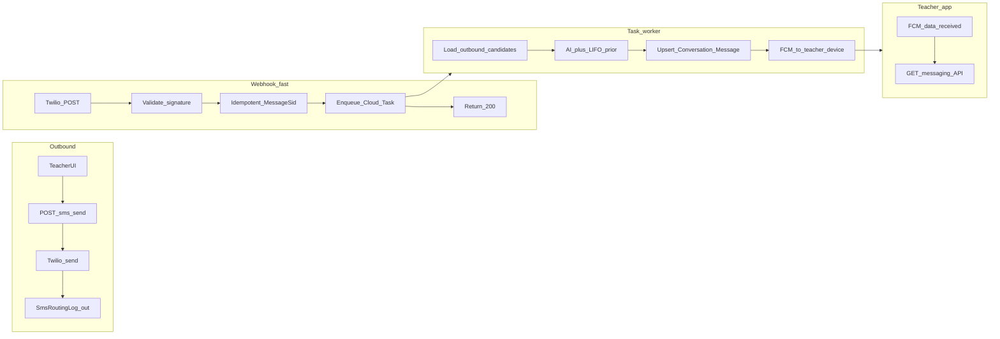

# Twilio masked SMS routing — alignment with this backend

This file is the **in-repository** copy of the communication-channel plan (Twilio SMS first; email, WhatsApp, calls later). The `communication` Django app implements it.

**Implementation status:** App scaffolded; `SmsRoutingLog`, Twilio outbound/inbound (signature + idempotent log), teacher `POST /api/teacher/sms/send/` implemented. **Service layer:** `communication/services/` (phone, `twilio_sms`, `outbound`, `inbound_processing` stub). Next: Cloud Tasks, AI routing, `Conversation`/`Message`, FCM.

---

## Implementation checklist

- [x] Django app `communication` + `api/communication/` + `api/webhooks/` wiring
- [x] `SmsRoutingLog` model and migration `0001_initial`
- [x] `TWILIO_*` settings + `env.example`; dependency `twilio` in `pyproject.toml`
- [x] `POST /api/webhooks/twilio/sms/` — signature, `MessageSid` idempotency, 200 (inline stub `process_inbound_sms_routing`)
- [ ] Cloud Tasks enqueue + OIDC worker (replace inline when `COMMUNICATION_PROCESS_SMS_INLINE=false`)
- [ ] OIDC-protected internal worker: AI + LIFO prior, `Conversation`/`Message` or admin, FCM
- [x] Teacher outbound SMS API `POST /api/teacher/sms/send/`
- [x] `MessageTemplate` table (`message_templates`) — channels: `sms`, `email`, `whatsapp`; placeholders documented in `variables` (SMS seeds use `{course_title}` only). Admin-editable. `GET /api/teacher/message-templates/?channel=sms`
- [ ] Admin inbox for uncertain / no-match inbounds
- [ ] FCM data payload contract with mobile/web client

---

## Does the spec fit?

**Yes, conceptually.** The backend has teachers (`users/models.py` — `TeacherProfile` with `phone_number`), students (`StudentProfile` with `child_phone` / `parent_phone`), and class instances (`courses/models.py` — `Class`). There is **no Twilio integration yet**; the closest pattern is signed webhooks + idempotency in `billings/views.py` (`StripeWebhookView`, `csrf_exempt`, signature verification).

**Important overlap:** In-app messaging already exists: `student/models.py` — `Conversation` and `Message`, exposed under `teacher/urls.py` (`ConversationMessagesView` — platform messages only, no SMS). A new **SMS routing log must not** reuse the name `Message` or the `messages` table.

---

## Django app: `communication` (multi-channel)

Dedicated app (name **`communication`**) to avoid confusion with in-app `Conversation` / `Message` and `MESSAGING_SYSTEM.md`. **Scope:** Twilio SMS first; later **email, WhatsApp, voice/calls**. Channel-specific webhooks and senders live here; **threads** stay in `student` (`Conversation`, `Message`). This app owns **provider integration** and **delivery/routing metadata** (e.g. `SmsRoutingLog`).

---

## Google Cloud Tasks vs deploying to GCP

1. **Deploy this Django project** to **Cloud Run** (or GKE/GAE).
2. The **Twilio webhook** validates the request, then calls the **Cloud Tasks API** to enqueue an HTTP task whose **target URL** is your Cloud Run service — e.g. `POST https://<service>/api/communication/internal/tasks/process-inbound-sms/` with **OIDC** so only Tasks can call it.
3. **IAM:** Service account can **enqueue** tasks; Cloud Tasks service account needs **invoker** on the worker URL.

**Worker URL = your Django view:** Regular route in this repo (e.g. `communication/views.py` or `communication/task_handlers.py`) with **AI routing, DB writes, FCM**. **OIDC** proves the caller is Cloud Tasks.

**Vs Celery:** Same pattern — webhook enqueues and returns; slow work runs in a **separate** HTTP invocation. Celery uses a broker + workers; Cloud Tasks uses GCP’s queue + HTTP to Cloud Run.

---

## Naming and schema (merge spec ↔ codebase)

| Spec | Recommendation |
|------|----------------|
| `MessageLog` | `SmsRoutingLog` (`db_table = 'sms_routing_logs'`) |
| `teacher_id` | `teacher` → `ForeignKey(User, …)` |
| `class_id` | Optional `course_class` → `ForeignKey(courses.Class, null=True)` |
| `student_phone` | `CharField(20)` + E.164 normalization |
| `direction` | `inbound` / `outbound` |
| `timestamp` | `created_at` (`auto_now_add`) |
| Index | `(student_phone, -created_at)` |

**Recommended extras:** `twilio_message_sid` (unique) for idempotency; optional `body_preview` / `raw_body`.

---

## `class_id` optional; AI + LIFO

Routing needs **teacher + student_phone + time** in the log. `class_id` helps **branding** and analytics, not strictly LIFO.

**AI + LIFO (agreed):** In the worker, load **all outbound** rows to this `From` in the lookback window. Model picks which outbound the reply matches; use **recency as prior** for vague replies; **low confidence → admin**. Persist routing metadata for debugging.

---

## Inbound pipeline: fast webhook + Cloud Tasks + FCM

**End-to-end asynchronous:** Twilio gets **200** before AI/FCM. Each HTTP handler is still synchronous until it returns.

1. **Webhook:** Validate signature, dedupe `MessageSid`, enqueue Cloud Task, **200**.
2. **Worker:** Load `SmsRoutingLog` candidates, AI + LIFO, upsert `Conversation`/`Message` or admin path.
3. **FCM** data message → client **pulls** teacher messaging API (Firebase does not call your API).
4. **Reliability:** Task retries; FCM best-effort; optional polling fallback.

Use **`firebase_admin.messaging`** (project already uses `firebase_admin` in `backend/settings.py`).

---

## URLs and security

- **Webhook:** `POST /api/webhooks/twilio/sms/` (register in `communication/webhook_urls.py`).
- **CSRF:** `csrf_exempt` on webhook (see `billings/views.py`).
- **Auth:** Validate `X-Twilio-Signature`; full public URL must match Twilio config.
- **Secrets:** `TWILIO_ACCOUNT_SID`, `TWILIO_AUTH_TOKEN`, `TWILIO_FROM_NUMBER`; optional `backend/secret_manager.py`.
- **Worker:** OIDC-only; no public unauthenticated “run AI” URL.

---

## Business logic (existing data)

- **Outbound:** Same access rules as `teacher/views.py` — `ConversationMessagesView`. Optional class branding: `[SBTY Academy - {Class.name}] {Teacher}: {body}`.
- **Inbound candidates:** `SmsRoutingLog` outbounds to `From` in window, ordered by time — full list to the model.
- **Teacher UX:** In-app message + FCM ping (optional SMS to teacher later).

**Admin inbox:** Rows for AI-uncertain / no-match; Django Admin + future staff API.

---

## Outbound API (suggested)

- `GET /api/teacher/message-templates/?channel=sms` — returns `{ "channel", "templates": [ { slug, label, body_template, subject_template?, variables } ] }`. UI fills `{course_title}` from `Class.course.title` (one class per course per teacher is assumed); still send `class_id` on `POST /api/teacher/sms/send/` for access checks and SMS prefix branding (`Class.name` in bracket — optional product tweak later to use course title only in prefix).
- `POST /api/teacher/sms/send/` with `student_user_id`, rendered `message`, optional `class_id`.

---

## Diagram

---

## Summary

Single Twilio number; **`SmsRoutingLog`** (not `Message`); optional **`course_class`**; webhook **fast** + **Cloud Task** worker; **AI + LIFO prior**, **uncertain → admin**; persist to **`Conversation` / `Message`**; **FCM + client pull**; **MessageSid** idempotency; **OIDC** worker.
