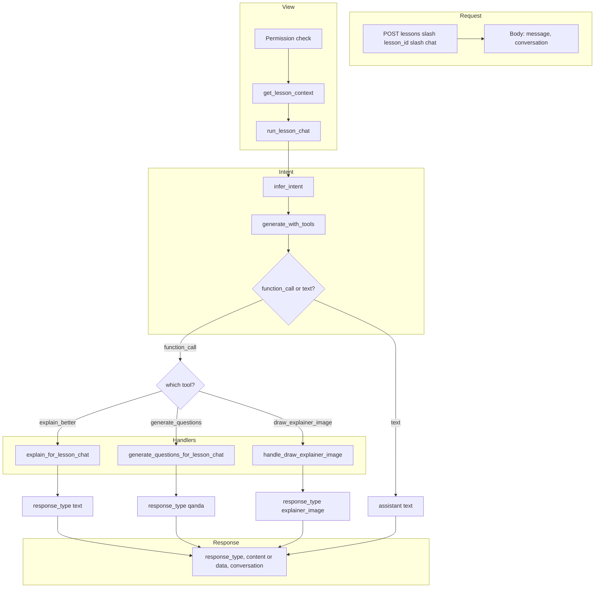

# Lesson chat (REST, list-based) – phased plan

Chat window for the current lesson: student sends messages; backend infers intent and either returns text (e.g. “explain this better”) or structured output (e.g. “generate questions”). Conversation is a list sent with each request; no WebSocket. Lesson content is cached at the backend.

---

## Response type so the frontend can choose the right template

The frontend must know **what kind of response** was returned so it can render it with the correct template (e.g. plain text vs Q&A list). Two ways to support that:

**Option A – Top-level `response_type` + payload (recommended)**  
Every response includes a **`response_type`** that tells the client which template to use for the **latest** message:

- **`response_type: "text"`** – Plain explanation or chat text. Use a simple text/markdown template. Payload: `content` (string).
- **`response_type: "qanda"`** – Question-and-answer structured block. Use the Q&A template. Payload: `data` (e.g. `{ "items": [ { "question": "...", "answer": "..." } ] }` or your schema).
- Later: `"summary"`, `"quiz"`, etc., each with a defined payload shape.

Response shape:

```json
{
  "response_type": "text",
  "content": "Here is a simpler explanation...",
  "conversation": [ ... ]
}
```

or for structured:

```json
{
  "response_type": "qanda",
  "data": { "items": [ { "question": "...", "answer": "..." } ] },
  "conversation": [ ... ]
}
```

Frontend: `if (response_type === 'qanda') render QandATemplate(data); else if (response_type === 'text') render TextTemplate(content);`.

**Option B – Typed messages inside the conversation**  
Each assistant message in the list carries its own type and payload, so the list is self-describing when re-rendering history:

```json
{
  "conversation": [
    { "role": "user", "content": "Explain this better" },
    { "role": "assistant", "type": "text", "content": "..." },
    { "role": "user", "content": "Generate questions" },
    { "role": "assistant", "type": "qanda", "data": { "items": [...] } }
  ]
}
```

**Recommendation:** Use **both**: (1) Return **`response_type`** (and `content` or `data`) at the top level so the client can immediately render the latest reply with the right template. (2) Append the same turn to **`conversation`** with a **`type`** (and optional **`content`** / **`data`**) on each assistant message so when the client re-renders the full thread it can again choose the template per message. That way the frontend always has an explicit type for the current response and for every past assistant message.

---

## Phase 1: REST endpoint and request/response shape

**Goal:** One POST endpoint that accepts lesson_id, message, and conversation list; returns a response so the client can append to the list. No AI yet (or minimal stub).

| Task | Status |
|------|--------|
| Define URL and view (e.g. POST `/api/tutorx/lessons/<lesson_id>/chat/` or under student/courses) | Done – `LessonChatView`, `path('lessons/<uuid:lesson_id>/chat/', ...)` |
| Request body: `lesson_id` (or from URL), `message`, `conversation` (list of `{ "role": "user" \| "assistant", "content": "..." }`) | Done – `LessonChatRequestSerializer`: `message` (required), `conversation` (optional list) |
| Response: include **`response_type`** (e.g. `"text"` \| `"qanda"`) and **`content`** or **`data`** plus **`conversation`** so frontend can pick template (see above) | Done – `response_type`, `content`, `conversation`; assistant message in list has `type` and `content` |
| Permission: enrolled student or course teacher for that lesson | Done – same as TutorXLessonAskView (teacher or EnrolledCourse active/completed) |
| Stub or echo response (no model call) to verify client contract | Done – stub echoes message; `response_type: "text"` |

**Exit criteria:** Client can POST and get back a consistent shape; conversation list is returned with one new assistant turn appended.

---

## Phase 2: Lesson context loader and cache

**Goal:** Backend loads lesson content for the given lesson_id and caches it so we don’t hit the DB every message. No inference yet, or only a single “use context” test.

| Task | Status |
|------|--------|
| Build “lesson context” string (or dict) from lesson: title + body (e.g. text_content or tutorx_content by type) | Done – `tutorx/services/lesson_chat.py`: title + `Lesson.tutorx_content` |
| Cache key: `lesson_chat:{lesson_id}` (or with user_id if needed later) | Done – `lesson_chat:{lesson_id}` |
| TTL: configurable (e.g. 5–15 min or 1 hr max); e.g. `LESSON_CHAT_CACHE_TTL_SECONDS` in settings | Done – `backend/settings.py`: default 600 |
| On request: `cache.get(key)`; if miss, load lesson from DB, build context, `cache.set(key, context, timeout=ttl)` | Done – `get_lesson_context(lesson_id)` |
| Use Django cache backend (LocMemCache for dev, Redis if available in prod) | Done – uses default cache |

**Exit criteria:** Lesson context is available to the handler; repeated requests for the same lesson_id use cache (no DB read after first request within TTL).

---

## Phase 3: Function-calling schema and “explain better” flow

**Goal:** Model receives user message + lesson context and a small function-calling schema. If the user asks to “explain” (e.g. “explain this phrase better” / “explain like I’m 2”), we call an explain handler and return plain text.

| Task | Status |
|------|--------|
| Define lesson-chat function schema (e.g. `explain_better`, `generate_questions`) with descriptions so the model can infer intent | Done – `get_lesson_chat_tool_schemas_vertex()` in tutorx/schemas.py; GeminiService.generate_with_tools in ai/gemini_service.py |
| Send to model: system prompt (use lesson context), conversation history, user message, and function declarations | Done – `infer_intent()` in tutorx/services/lesson_chat.py |
| If model returns a function_call for `explain_better`: call handler with phrase + cached lesson context; return text (no structured schema) | Done – `TutorXAIService.explain_for_lesson_chat()`; dispatch in `run_lesson_chat()` |
| If model returns only text (no function call): return that text as the assistant message | Done – `run_lesson_chat()` returns intent text as content |
| Append assistant response to conversation list and return in response | Done – view appends assistant_msg to conversation |

**Exit criteria:** Student can send “explain [phrase] better” (or similar); backend uses phrase + lesson and returns a plain-text explanation; conversation list is updated correctly.

---

## Phase 4: “Generate questions” (or Q&A) with structured output

**Goal:** When the student asks to generate questions (and optionally “question and answer”), backend uses the appropriate handler with its own prompt and a defined response schema; return structured JSON.

| Task | Status |
|------|--------|
| Add `generate_questions` (or `generate_qa`) to the lesson-chat function schema with a clear description | Done – `get_lesson_chat_tool_declarations()` in tutorx/schemas.py |
| Implement handler: dedicated system prompt + lesson context (+ user’s question/answer if provided); call model with response schema | Done – `generate_questions_for_lesson_chat()`; intent via `is_generate_questions_intent()` |
| Define structured output schema (e.g. list of `{ question, answer, type? }` or match existing quiz/assignment schema) | Done – reuses `get_student_generate_questions_schema()` |
| Return with **`response_type: "qanda"`** and **`data`** (structured payload); append to conversation with **`type: "qanda"`** and **`data`** so history re-renders with same template | Done – view returns `data`; assistant message has `type`, `data` |
| Frontend uses `response_type === "qanda"` to render current reply with Q&A template; past messages use each message’s `type` | |

**Exit criteria:** Student can say “generate questions” (or “generate question and answer”); backend returns the expected structured payload; conversation list still includes this turn in a consistent way.

---

## Phase 5: Optional polish and more intents

**Goal:** Cache invalidation, more intents if needed, and light docs.

| Task | Status |
|------|--------|
| Optional: on lesson save (admin or API), invalidate `lesson_chat:{lesson_id}` so edits are visible after TTL | Done – `invalidate_lesson_chat_cache()` in lesson_chat.py; called from PUT content view and from post_save signal on Lesson |
| Optional: add more functions (e.g. summarize_lesson, clarify_term) with their own prompts and optional schemas | Optional for later |
| Document: request/response shape, supported intents, cache TTL, and where the code lives | Done – API_REFERENCE.md (lesson chat); LESSON_CHAT_FRONTEND.md (frontend); LESSON_CHAT_TUTORIAL.md (concepts) |

**Exit criteria:** Behaviour is stable; any new intents are documented; cache behaviour is clear.

---

## Lesson chat flow (request to response)



---

## Summary

| Phase | Focus | Outcome |
|-------|--------|--------|
| **1** | REST + list contract | Endpoint and request/response shape; conversation as list; permission check |
| **2** | Lesson context + cache | Load lesson; cache by lesson_id with short TTL; no full content sent from client |
| **3** | Function-calling + explain | Model infers intent; explain_better uses phrase + lesson; plain-text reply |
| **4** | Generate Q&A structured | generate_questions handler; own prompt + schema; structured JSON in response |
| **5** | Polish | Cache invalidation, extra intents, docs |

---

## Notes

- **No WebSocket:** All interaction is request/response; conversation is a list sent and returned each time.
- **Cache:** Lesson content is cached at the backend for a few minutes up to 1 hour; client only sends lesson_id and messages.
- **Align with lesson:** All AI responses use only the current lesson context (and conversation history).
- **Style:** Same pattern as course-management chat: function-calling schema → model infers → backend dispatches to handler; each handler has its own system prompt and, when defined, structured output.
- **Frontend rendering:** Every response includes **`response_type`** (e.g. `text`, `qanda`); assistant messages in **`conversation`** include **`type`** (and `content` or `data`) so the client can always choose the correct template to render.
